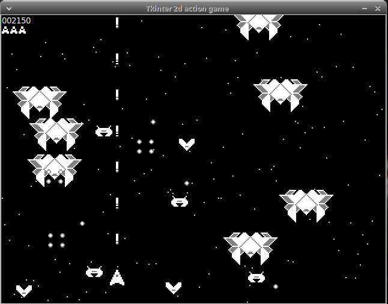

# tkinter_2d_action_game

This is the python tkinter version of the [Proof of Concept for a Gtk4 2D action game written in c](https://github.com/lavalfils/poc_gtk4_2D_action_game) using the tkinter canvas widget.

## How to play

* Arrow keys to move ship
* Space bar to shoot



## Issues

* No sound fx
* No tint effects when alien ships get hit. (Could created tinted sprite versions and swap them to create the tint effect)
* On linux when holding the keys down, i always get a pair of keypress and keyrelease events when i am only expecting keypress events and only keyrelease event when i release the key. To bypass this problem i use os.system('xset r off') before starting the game and os.system('xset r on') when closing the game. But the 'xset r off' affects all other applications while the game is running. May be need to find another solution for that.

## Requirements

* Latest Python 3 and tkinter. Also works on Windows with latest python3 installed.

## run
```
python3 game.py
```
